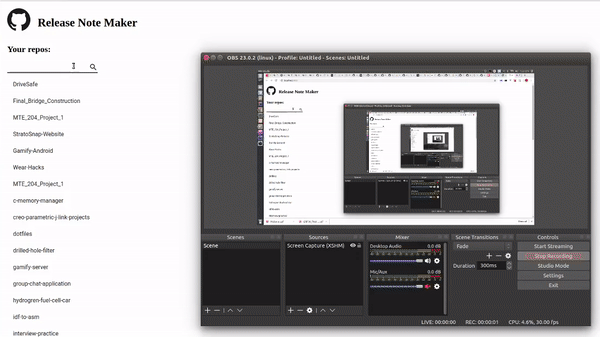

# Release Note Maker
Use the Github API to generate Release Notes from a list of commit messages

## Demo


1. Login to Github
2. Select your repos
3. Select your commits
4. Generate release note
5. Resulting release note will be displayed

### Documentation
The tool will generate a release with the target being the selected most recent commit in the tree (based on commit SHA). It gets the most recent release tag and bumps it one major version i.e `v2.0.0 -> v3.0.0`. The contents of the release notes are generated by looking through commits and performing basic classification for (Added, Changed, and Removed).

## Quick Start
Use a .env file in the root directory 
```
DEV_CLIENT_ID=<Your Client Id>
DEV_CLIENT_SECRET=<Your Client Secret>
DEV_HOST=http://localhost:8080
```


```bash
# Start dev server
yarn run dev
```

### Development mode

In the development mode, we will have 2 servers running. The front end code will be served by the [webpack dev server](https://webpack.js.org/configuration/dev-server/) which helps with hot and live reloading. The server side Express code will be served by a node server using [nodemon](https://nodemon.io/) which helps in automatically restarting the server whenever server side code changes.

### Production mode

In the production mode, we will have only 1 server running. All the client side code will be bundled into static files using webpack and it will be served by the Node.js/Express application.

### Notable Dependencies 
- [material-ui](https://material-ui.com) - UI components
- [fuse.js](https://fusejs.io) - fuzzy searching for repos
- [moment](https://momentjs.com/) - commits date conversions
- [semver](https://github.com/npm/node-semver) - version bumping semantics
- [randomstring](https://github.com/rexxars/react-markdownttps://github.com/klughammer/node-randomstring) - generate random string to protect against forgery attacks and could contain any other arbitrary data required by Github Oauth
- [react-markdown](https://github.com/rexxars/react-markdown) - displaying created release message in Markdown 


### Folder Structure

All the source code will be inside **src** directory. Inside src, there is client and server directory. All the frontend code (react, css, js and any other assets) will be in client directory. Backend Node.js/Express code will be in the server directory.
